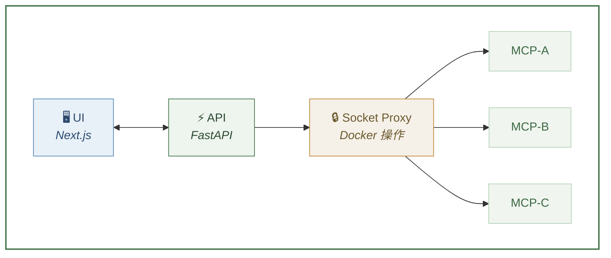
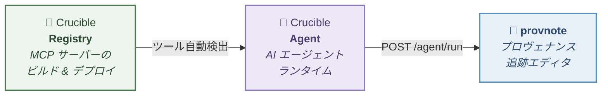

[English](README.md)

[](https://github.com/kumagallium/Crucible/actions/workflows/test.yml)

# Crucible

> **MCP サーバーのためのセルフホスト型デプロイメントプラットフォーム。**
> GitHub URL を貼るだけ。ビルド、デプロイ、接続 — 数分で完了。

**Crucible** は GitHub リポジトリから MCP サーバーを直接ビルド・デプロイするセルフホスト型プラットフォームです。プライベートリポジトリにも対応。URL を貼るだけで自動ビルド・デプロイし、SSE エンドポイントとして公開します。npm や Docker Hub への公開は不要。チームの共有インフラとしても、個人の実験用サンドボックスとしても使えます。

## 特徴

- **GitHub URL からビルド** — リポジトリ URL を貼るだけで自動ビルド＆デプロイ。npm への公開ステップを飛ばして、ソースコードから直接サーバーを起動
- **プライベートリポジトリ対応** — プライベート GitHub リポジトリに対応。非公開のまま MCP サーバーを開発・デプロイ可能
- **即座にイテレーション** — コードを修正したら GitHub に push して再デプロイするだけ。コードから動作確認までのフィードバックループが最短に
- **stdio → SSE 自動変換** — stdio サーバーも自動的に SSE エンドポイントとして公開。ローカルでもリモートでも、あらゆる MCP クライアントからテスト可能
- **管理 UI** — デプロイ済みサーバーをダッシュボードで一覧管理。起動・停止・削除で環境を整理
- **セキュア＆セルフホスト** — すべてあなたのインフラ上で動作。Docker Socket Proxy で Docker 操作を最小権限に制限。データが外部に出ることはない

## こんな方に

- **MCP サーバー開発者** — `git push` から数秒でサーバーを動かしたい方。パッケージ公開や Dockerfile 作成は不要。個人のサンドボックスとして高速にイテレーション
- **研究チーム・組織** — メンバーに専門領域の MCP サーバーを開発してもらいたい環境に。共有プラットフォームで全員がデプロイ・実験可能
- **GitHub で MCP サーバーを探している方** — npm や Docker Hub に未公開のサーバーも、URL を貼るだけで試せる

> [詳しいユースケースとシナリオはウェブサイトをご覧ください](https://kumagallium.github.io/Crucible/)

## アーキテクチャ



## クイックスタート

### 前提条件

- Docker & Docker Compose
- Git

### セットアップ

```bash
# 1. クローン
git clone https://github.com/kumagallium/Crucible.git
cd Crucible

# 2. セットアップスクリプトを実行（.env 自動生成 + git hooks 設定）
./setup.sh

# 3. 起動
docker compose up -d
```

#### Dify 連携を使う場合

同じホストで Dify を動かしている場合、自動ツール登録を有効にできます:

```bash
docker compose -f docker-compose.yml -f docker-compose.dify.yml up -d
```

### アクセス

- **UI**: http://127.0.0.1:8081
- **API**: http://127.0.0.1:8080

## サーバーデプロイ

**Ubuntu 22.04 LTS** でテスト済み。セットアップスクリプトが Docker のインストール、セキュリティ強化、Crucible の起動を一括で行います。

```bash
git clone https://github.com/kumagallium/Crucible.git
cd Crucible
sudo bash setup-server.sh
```

### `setup-server.sh` が行うこと

| ステップ | 内容 |
|---------|------|
| Docker | Docker CE + Compose plugin をインストール |
| SSH | 鍵認証のみ、root ログイン禁止 |
| ファイアウォール (UFW) | インバウンド deny（SSH / 8080 / 8081 のみ許可） |
| fail2ban | SSH 5回失敗で24時間 BAN |
| Docker iptables | Socket Proxy への外部アクセスをブロック、UDP フラッド対策 |
| 自動更新 | セキュリティパッチを自動適用 |

### オプション

```bash
# SSH ポートを変更（本番環境では推奨）
SSH_PORT=<your-port> sudo bash setup-server.sh
```

## 環境変数

| 変数名 | デフォルト | 説明 |
|--------|-----------|------|
| `CRUCIBLE_HOST` | `127.0.0.1` | ポートバインド先 IP |
| `CRUCIBLE_API_PORT` | `8080` | API 公開ポート |
| `CRUCIBLE_UI_PORT` | `8081` | UI 公開ポート |
| `CRUCIBLE_BASE_URL` | `http://127.0.0.1` | MCP サーバーの SSE ベース URL |
| `CRUCIBLE_CORS_ORIGINS` | *(localhost)* | CORS 許可オリジン（カンマ区切り） |
| `REGISTRY_API_KEY` | *(なし)* | API 認証キー |
| `TOKEN_ENCRYPTION_KEY` | *(なし)* | GitHub Token 暗号化キー |

詳細は [.env.example](.env.example) を参照してください。

## リモートアクセス（オプション）

別のマシンから Crucible にアクセスしたい場合は、環境変数でバインド先 IP を変更してください。

```env
# 例: VPN 経由でアクセスする場合
CRUCIBLE_HOST=10.0.0.1
CRUCIBLE_BASE_URL=http://10.0.0.1
CRUCIBLE_CORS_ORIGINS=http://10.0.0.1:8081,http://localhost:8081
```

ローカルで利用する場合（デフォルト）は設定不要です。

## MCP クライアントからの接続

Crucible にデプロイした MCP サーバーは SSE エンドポイント経由で接続できます。

### Claude Code

```bash
claude mcp add --transport sse <サーバー名> http://<host>:<port>/sse
```

### Cursor / Windsurf

設定画面から SSE URL を追加するだけで接続できます。

### Claude Desktop

Claude Desktop は SSE に直接対応していないため、[mcp-remote](https://www.npmjs.com/package/mcp-remote) を使って stdio-SSE 変換を行います。詳しくは UI の **Guide** タブを参照してください。

## Integrations（オプション）

### Dify

Crucible はデプロイした MCP サーバーを Dify にツールとして自動登録できます。
`.env` に `DIFY_EMAIL` と `DIFY_PASSWORD` を設定して有効化してください。

## 技術スタック

| 要素 | 技術 |
|------|------|
| API | Python / FastAPI |
| UI | TypeScript / Next.js / shadcn/ui |
| コンテナ管理 | Docker / Docker Socket Proxy |
| MCP SDK | `@modelcontextprotocol/sdk` / `mcp` (Python) |

## ドキュメント & ウェブサイト

- [ウェブサイト（詳細なユースケース）](https://kumagallium.github.io/Crucible/)

## 関連プロジェクト

Crucible はエコシステムの一部として機能します：



| リポジトリ | 役割 | リンク |
|-----------|------|--------|
| **Crucible** (Registry) | MCP サーバーのビルド・デプロイ・管理 | *(このリポジトリ)* |
| **Crucible Agent** | MCP ツール対応 AI エージェントランタイム | [kumagallium/crucible-agent](https://github.com/kumagallium/crucible-agent) |
| **provnote** | PROV-DM プロヴェナンス追跡エディタ | [kumagallium/provnote](https://github.com/kumagallium/provnote) |

各プロジェクトは単体でも使えます。組み合わせると、Registry が MCP サーバーを管理 → Agent が LLM と接続 → provnote がプロヴェナンス付きの UI を提供、というパイプラインになります。

## ライセンス

[MIT License](LICENSE)
