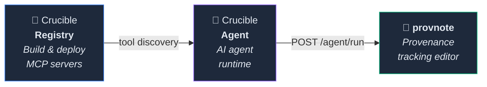

[日本語](README.ja.md)

[](https://github.com/kumagallium/Crucible/actions/workflows/test.yml)

# Crucible

> **The self-hosted deployment platform for MCP servers.**
> Paste a GitHub URL — build, deploy, and connect in minutes.

**Crucible** is a self-hosted platform that builds and deploys MCP servers directly from GitHub repositories — including private repos. Paste a URL and Crucible automatically builds, deploys, and exposes it as an SSE endpoint. No need to publish to npm or Docker Hub first. Use it as your team's shared infrastructure or as a personal sandbox to iterate fast.

## Key Features

- **Build from any GitHub URL** — Paste a repository URL and Crucible builds and deploys it automatically. Skip the publish-to-npm step and go straight from source to running server.
- **Private repository support** — Works with private GitHub repositories. Develop your MCP servers behind closed doors and deploy them without ever making them public.
- **Instant iteration** — Made a change? Push to GitHub, redeploy from Crucible. The feedback loop from code to running server is as short as it gets.
- **Automatic stdio → SSE** — stdio-only servers are automatically exposed as SSE endpoints, so you can test them from any MCP client, local or remote.
- **Management UI** — See all your servers in one dashboard. Start, stop, remove — keep your environment clean.
- **Secure & self-hosted** — Runs entirely on your infrastructure. Docker Socket Proxy limits Docker operations to minimum privileges. Nothing leaves your network.

## Who is Crucible for?

- **MCP server developers** who want to go from `git push` to a running server in seconds — without publishing packages or writing Dockerfiles first. Use Crucible as your sandbox to iterate fast.
- **Research teams and organizations** encouraging members to build domain-specific MCP servers — Crucible gives everyone a shared platform to deploy and experiment.
- **Anyone exploring GitHub** for MCP servers that aren't on npm or Docker Hub yet — just paste the URL and try it.

> [See detailed use cases and scenarios on our website](https://kumagallium.github.io/Crucible/)

## Architecture

```
┌─────────────────────────────────────┐
│            Crucible                  │
│  ┌─────────┐      ┌──────────────┐  │
│  │   UI    │◄────►│   API        │  │
│  │ Next.js │      │  FastAPI     │  │
│  └─────────┘      └──────┬───────┘  │
│                          │          │
│              ┌───────────▼────────┐ │
│              │  Socket Proxy      │ │
│              │  (Docker ops)      │ │
│              └───────────┬────────┘ │
│                          │          │
│  ┌──────┐ ┌──────┐ ┌──────┐       │
│  │MCP-A │ │MCP-B │ │MCP-C │ ...   │
│  └──────┘ └──────┘ └──────┘       │
└─────────────────────────────────────┘
```

<!-- TODO: Add demo GIF showing: paste GitHub URL → auto build → deploy → connect from Claude Code via SSE -->

## Quick Start

### Prerequisites

- Docker & Docker Compose
- Git

### Setup

```bash
# 1. Clone
git clone https://github.com/kumagallium/Crucible.git
cd Crucible

# 2. Run setup script (generates .env with auto-generated keys, configures git hooks)
./setup.sh

# 3. Start
docker compose up -d
```

#### With Dify integration

If you run Dify on the same host and want automatic tool registration:

```bash
docker compose -f docker-compose.yml -f docker-compose.dify.yml up -d
```

### Access

- **UI**: http://127.0.0.1:8081
- **API**: http://127.0.0.1:8080

## Server Deployment

Tested on **Ubuntu 22.04 LTS**. The setup script installs Docker, configures security hardening, and starts Crucible.

```bash
git clone https://github.com/kumagallium/Crucible.git
cd Crucible
sudo bash setup-server.sh
```

### What `setup-server.sh` does

| Step | Description |
|------|-------------|
| Docker | Installs Docker CE + Compose plugin |
| SSH | Key-only auth, root login disabled |
| Firewall (UFW) | Inbound deny (SSH / 8080 / 8081 only), outbound allowlist |
| fail2ban | Auto-ban after 5 failed SSH attempts (24h) |
| Docker iptables | Blocks external access to Socket Proxy, UDP flood protection |
| Auto-update | Unattended security patches |

### Options

```bash
# Change SSH port (recommended for production)
SSH_PORT=<your-port> sudo bash setup-server.sh
```

## Environment Variables

| Variable | Default | Description |
|----------|---------|-------------|
| `CRUCIBLE_HOST` | `127.0.0.1` | IP address to bind ports to |
| `CRUCIBLE_API_PORT` | `8080` | API port |
| `CRUCIBLE_UI_PORT` | `8081` | UI port |
| `CRUCIBLE_BASE_URL` | `http://127.0.0.1` | Base URL for MCP server SSE endpoints |
| `CRUCIBLE_CORS_ORIGINS` | *(localhost)* | Allowed CORS origins (comma-separated) |
| `REGISTRY_API_KEY` | *(none)* | API authentication key |
| `TOKEN_ENCRYPTION_KEY` | *(none)* | Encryption key for GitHub tokens |

See [.env.example](.env.example) for details.

## Remote Access (Optional)

To access Crucible from another machine, update the bind address in your environment variables:

```env
# Example: access via VPN
CRUCIBLE_HOST=10.0.0.1
CRUCIBLE_BASE_URL=http://10.0.0.1
CRUCIBLE_CORS_ORIGINS=http://10.0.0.1:8081,http://localhost:8081
```

No configuration is needed for local-only use (default).

## Connecting from MCP Clients

MCP servers deployed on Crucible are accessible via SSE endpoints.

### Claude Code

```bash
claude mcp add --transport sse <server-name> http://<host>:<port>/sse
```

### Cursor / Windsurf

Add the SSE URL from the settings screen.

### Claude Desktop

Claude Desktop does not natively support SSE. Use [mcp-remote](https://www.npmjs.com/package/mcp-remote) for stdio-to-SSE bridging. See the **Guide** tab in the UI for details.

## Integrations (Optional)

### Dify

Crucible can automatically register deployed MCP servers as tools in Dify.
Set `DIFY_EMAIL` and `DIFY_PASSWORD` in your `.env` to enable.

## Tech Stack

| Component | Technology |
|-----------|------------|
| API | Python / FastAPI |
| UI | TypeScript / Next.js / shadcn/ui |
| Container management | Docker / Docker Socket Proxy |
| MCP SDK | `@modelcontextprotocol/sdk` / `mcp` (Python) |

## Documentation & Website

- [Website (detailed use cases)](https://kumagallium.github.io/Crucible/)

## Related Projects

Crucible is part of a broader ecosystem:



| Repository | Role | Link |
|------------|------|------|
| **Crucible** (Registry) | MCP server build, deploy & management | *(this repo)* |
| **Crucible Agent** | AI agent runtime with MCP tool support | [kumagallium/crucible-agent](https://github.com/kumagallium/crucible-agent) |
| **provnote** | PROV-DM provenance tracking editor | [kumagallium/provnote](https://github.com/kumagallium/provnote) |

Each project works independently. Together, they form a complete pipeline: Registry manages MCP servers → Agent connects them to LLMs → provnote provides a UI with provenance tracking.

## License

[MIT License](LICENSE)
