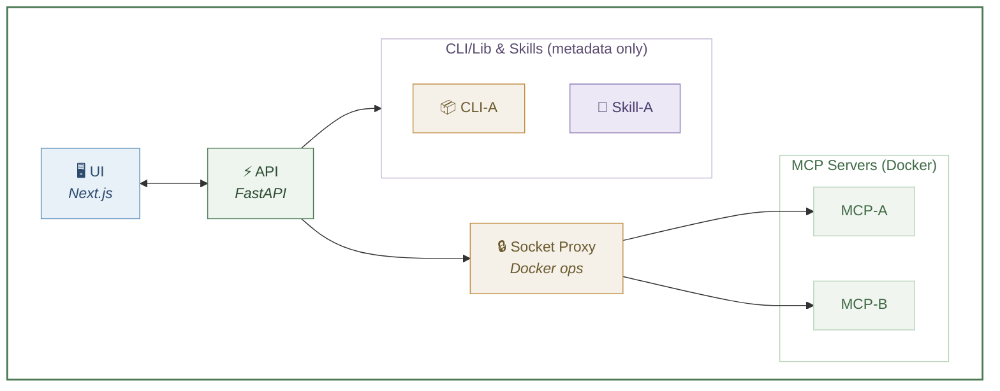
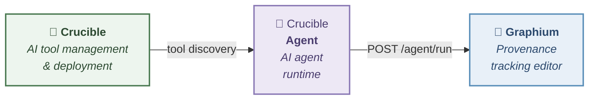

[日本語](README.ja.md)

[](https://github.com/kumagallium/Crucible/actions/workflows/test.yml)

# Crucible

> **Your team's AI tool shelf — deploy MCP servers, register CLI libraries and skills.**
> Build, deploy, and manage all your AI tools in one place.

**Crucible** is a self-hosted platform that manages three types of AI tools:

- **MCP Servers** — Build and deploy from GitHub URLs. Automatically containerized with Docker and exposed as SSE endpoints.
- **CLI / Libraries** — Register pip/npm packages without Docker. Track install commands and metadata alongside your MCP servers.
- **Skills** — Register markdown-based prompts and procedures. Lightweight entries that require no deployment.

Use it as your team's shared tool shelf or as a personal sandbox. Crucible auto-detects whether a repository is an MCP server (by checking for MCP SDK dependencies) or a CLI library, and routes it to the appropriate registration path.

## Key Features

- **Three-layer tool model** — Manage MCP servers, CLI libraries, and skills in one place with type-aware filtering and display.
- **Build from any GitHub URL** — Paste a repository URL and Crucible builds and deploys MCP servers automatically. Dockerfile auto-generated if missing.
- **Lightweight registration** — CLI libraries and skills are registered instantly without Docker deployment. Just metadata and install commands.
- **Private repository support** — Works with private GitHub repositories. Develop behind closed doors and deploy without ever making them public.
- **Auto-detect tool type** — Crucible inspects dependencies (e.g., `mcp` in pyproject.toml, `@modelcontextprotocol/sdk` in package.json) to classify tools automatically.
- **Instant iteration** — Push to GitHub, redeploy from Crucible. The feedback loop from code to running server is as short as it gets.
- **Auto-update** — Enable `auto_update` on a server and Crucible will periodically check its GitHub repository for new commits and redeploy automatically.
- **Automatic stdio → SSE** — stdio-only MCP servers are automatically exposed as SSE endpoints.
- **Management UI** — See all your tools in one dashboard. Filter by status and type. Start, stop, remove — keep your environment clean.
- **Secure & self-hosted** — Runs entirely on your infrastructure. Docker Socket Proxy limits Docker operations to minimum privileges.

## Who is Crucible for?

- **MCP server developers** who want to go from `git push` to a running server in seconds — without publishing packages or writing Dockerfiles first.
- **Research teams and organizations** building a shared library of AI tools — MCP servers for heavy automation, CLI tools for quick utilities, skills for reusable prompts.
- **Anyone exploring GitHub** for AI tools — paste the URL and register it, whether it's an MCP server, a pip package, or something in between.

> [See detailed use cases and scenarios on our website](https://kumagallium.github.io/Crucible/)

## Architecture



## Quick Start

### Prerequisites

- Docker & Docker Compose
- Git

### Setup

```bash
# 1. Clone
git clone https://github.com/kumagallium/Crucible.git
cd Crucible

# 2. Run setup script (generates .env with auto-generated keys, configures git hooks)
./setup.sh

# 3. Start
docker compose up -d
```

#### With Dify integration

If you run Dify on the same host and want automatic tool registration:

```bash
docker compose -f docker-compose.yml -f docker-compose.dify.yml up -d
```

### Access

- **UI**: http://127.0.0.1:8081
- **API**: http://127.0.0.1:8080

## Server Deployment

Tested on **Ubuntu 22.04 LTS**. The setup script installs Docker, configures security hardening, and starts Crucible.

```bash
git clone https://github.com/kumagallium/Crucible.git
cd Crucible
sudo bash setup-server.sh
```

### What `setup-server.sh` does

| Step | Description |
|------|-------------|
| Docker | Installs Docker CE + Compose plugin |
| SSH | Key-only auth, root login disabled |
| Firewall (UFW) | Inbound deny (SSH / 8080 / 8081 only), outbound allowlist |
| fail2ban | Auto-ban after 5 failed SSH attempts (24h) |
| Docker iptables | Blocks external access to Socket Proxy, UDP flood protection |
| Auto-update | Unattended security patches |

### Options

```bash
# Change SSH port (recommended for production)
SSH_PORT=<your-port> sudo bash setup-server.sh
```

## Environment Variables

| Variable | Default | Description |
|----------|---------|-------------|
| `CRUCIBLE_HOST` | `127.0.0.1` | IP address to bind ports to |
| `CRUCIBLE_API_PORT` | `8080` | API port |
| `CRUCIBLE_UI_PORT` | `8081` | UI port |
| `CRUCIBLE_BASE_URL` | `http://127.0.0.1` | Base URL for MCP server SSE endpoints |
| `CRUCIBLE_CORS_ORIGINS` | *(localhost)* | Allowed CORS origins (comma-separated) |
| `REGISTRY_API_KEY` | *(none)* | API authentication key |
| `TOKEN_ENCRYPTION_KEY` | *(none)* | Encryption key for GitHub tokens |
| `AUTO_UPDATE_INTERVAL` | `3600` | Auto-update check interval in seconds (0 to disable) |

See [.env.example](.env.example) for details.

## Remote Access (Optional)

To access Crucible from another machine, update the bind address in your environment variables:

```env
# Example: access via VPN
CRUCIBLE_HOST=10.0.0.1
CRUCIBLE_BASE_URL=http://10.0.0.1
CRUCIBLE_CORS_ORIGINS=http://10.0.0.1:8081,http://localhost:8081
```

No configuration is needed for local-only use (default).

## Connecting from MCP Clients

MCP servers deployed on Crucible are accessible via SSE endpoints. CLI/Library and Skill entries are metadata-only and don't expose endpoints.

### Claude Code

```bash
claude mcp add --transport sse <server-name> http://<host>:<port>/sse
```

### Cursor / Windsurf

Add the SSE URL from the settings screen.

### Claude Desktop

Claude Desktop does not natively support SSE. Use [mcp-remote](https://www.npmjs.com/package/mcp-remote) for stdio-to-SSE bridging. See the **Guide** tab in the UI for details.

## Integrations (Optional)

### Dify

Crucible can automatically register deployed MCP servers as tools in Dify.
Set `DIFY_EMAIL` and `DIFY_PASSWORD` in your `.env` to enable.

## Tech Stack

| Component | Technology |
|-----------|------------|
| API | Python / FastAPI |
| UI | TypeScript / Next.js / shadcn/ui |
| Container management | Docker / Docker Socket Proxy |
| MCP SDK | `@modelcontextprotocol/sdk` / `mcp` (Python) |

## Documentation & Website

- [Website (detailed use cases)](https://kumagallium.github.io/Crucible/)

## Related Projects

Crucible is part of a broader ecosystem:



| Repository | Role | Link |
|------------|------|------|
| **Crucible** | AI tool management & deployment (MCP servers, CLI/Lib, Skills) | *(this repo)* |
| **Crucible Agent** | AI agent runtime with MCP tool support | [kumagallium/Crucible-Agent](https://github.com/kumagallium/Crucible-Agent) |
| **Graphium** | PROV-DM provenance tracking editor | [kumagallium/Graphium](https://github.com/kumagallium/Graphium) |

Each project works independently. Together, they form a complete pipeline: Crucible manages AI tools (MCP servers, CLI libraries, skills) → Agent connects them to LLMs → Graphium provides a UI with provenance tracking.

## License

[MIT License](LICENSE)
